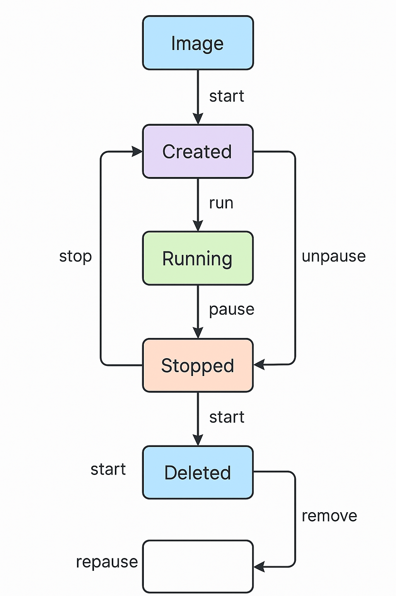
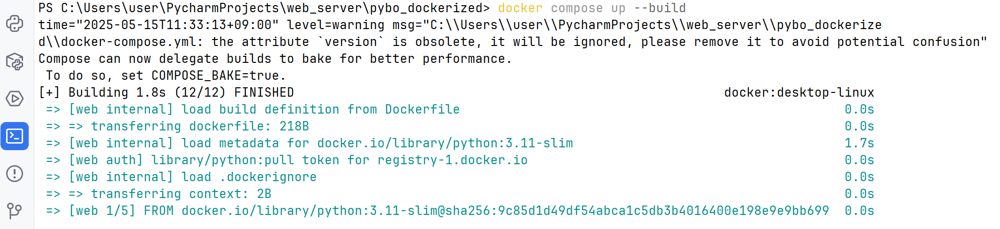

# Docker Django 서비스 운영

## Docker 컨테이너와 가상머신(Virtual Machine, VM)

- Docker 컨테이너와 가상머신(Virtual Machine, VM)은 모두 **격리된 환경**에서 애플리케이션을 실행하기 위한 기술
- 그 작동 방식과 목적은 매우 다름

---

## 🧱 구조적 차이

### ✅ 컨테이너 구조

- **애플리케이션 단위 격리**
- **호스트 OS의 커널을 공유**
- 컨테이너마다 독립된 파일 시스템, 프로세스, 네트워크 환경이 있음
- 매우 가볍고 빠름

```
+----------------+
| App A (컨테이너)|
| App B (컨테이너)|
+----------------+
| Container Engine (Docker) |
+----------------+
| Host OS (공통) |
+----------------+
| Physical Infrastructure |

```

---

### ✅ VM 구조

- **운영체제 단위 격리**
- 각 VM은 **자신만의 커널과 OS**를 포함
- 하드웨어를 **가상화하는 Hypervisor**가 필요

```
+--------------------------+
| Guest OS + App A (VM1)  |
| Guest OS + App B (VM2)  |
+--------------------------+
| Hypervisor (VMWare, KVM)|
+--------------------------+
| Host OS (실제 운영체제) |
+--------------------------+
| Physical Infrastructure |

```

---

## 🚀 성능 비교

| 항목 | 컨테이너 | 가상머신 |
| --- | --- | --- |
| **부팅 속도** | 수 초 | 수십 초~수 분 |
| **디스크 사용량** | 수십 MB~수백 MB | 수 GB 이상 |
| **자원 효율성** | 매우 높음 | 비교적 낮음 |
| **IO 성능** | 거의 네이티브 수준 | Hypervisor 통해 전달되어 느림 |

---

## 🔐 보안 및 격리 수준

| 항목 | 컨테이너 | 가상머신 |
| --- | --- | --- |
| **보안 격리** | 중간 (커널 공유) | 높음 (OS 완전 분리) |
| **공격 표면** | 컨테이너 간 공유 자원 노출 가능성 | 완전한 OS 분리로 공격면 좁음 |
| **적합 분야** | 빠른 실행, 테스트, 마이크로서비스 | 서로 다른 OS 실행, 완전한 보안 필요 |

---

## 📦 운영 및 사용성

| 항목 | 컨테이너 | 가상머신 |
| --- | --- | --- |
| **배포 방식** | 이미지로 저장 (버전 관리 쉬움) | VM 이미지 전체 복사 필요 |
| **개발자 경험** | Dockerfile 등 코드 기반 환경설정 | 수동 설정, 복잡한 구성 |
| **CI/CD 통합** | 용이 (GitHub Actions, Jenkins) | 느림, 설정 어려움 |
| **멀티 플랫폼** | 플랫폼 간 이식성 뛰어남 | OS 제약 존재 (예: macOS → Linux VM) |

---

## 💡 어떤 상황에 무엇을 사용할까?

| 목적/상황 | 컨테이너 추천 | VM 추천 |
| --- | --- | --- |
| 백엔드 마이크로서비스 | ✅ | ❌ |
| 서로 다른 OS에서 테스트 | ❌ | ✅ |
| 개발 환경 통일 | ✅ | 가능은 하나 비효율 |
| 고보안/고격리 환경 | ❌ | ✅ |
| 빠른 스케일 아웃 | ✅ | ❌ |

---

## 📷 시각적 요약

- 컨테이너는 호스트 OS의 커널을 공유하며 경량화된 실행 환경
- VM은 OS 단위로 격리되어 더 무겁지만 보안성 높음

📌 참고 이미지

- [✔ 컨테이너 생명주기 다이어그램](https://chatgpt.com/c/68254661-7268-8002-975a-765d7768e5eb#)
- [✔ 컨테이너 vs VM 비교 다이어그램](https://chatgpt.com/c/68254661-7268-8002-975a-765d7768e5eb#)

---

## 🎯 결론

| 컨테이너는 | 가볍고 빠르며, DevOps 및 클라우드 시대에 필수 |
| --- | --- |
| VM은 | 완전한 OS 격리가 필요한 상황에서 여전히 유용 |

---

## **가상화 방식의 핵심 차이점**

- "컨테이너는 **호스트 OS의 커널을 공유**하고",
- "가상머신(VM)은 **자신만의 커널과 OS를 포함**"

---

## 🌐 커널이란 무엇인가?

- *커널(Kernel)**은 운영체제의 핵심 중추로,
    
    > 하드웨어와 소프트웨어를 중재하는 역할을 합니다.
    > 
- 예: 메모리 할당, 프로세스 스케줄링, 파일 시스템, 네트워크 관리 등 모두 커널이 담당

---

## 🧱 VM: **자신만의 커널과 OS 포함**

### 구조

```
하드웨어
├── Host OS
│   └── Hypervisor
│       └── Guest OS (Ubuntu, Windows 등)
│           └── App 실행

```

### 의미

- 각 가상머신은 하드웨어 위에 **독립된 OS 전체를 포함**하고 실행됩니다.
- 따라서 **자신만의 커널을 가진 완전한 독립 시스템**처럼 동작합니다.
- 서로 다른 OS도 동시에 실행 가능 (ex: Windows 위에서 Ubuntu VM 실행)

### 예시

- Hyper-V, VMware, VirtualBox에서 Windows와 Ubuntu VM을 동시에 띄움
- 각각 독립된 리눅스 커널/윈도우 커널을 가짐

---

## 🐳 컨테이너: **호스트 OS의 커널을 공유**

### 구조

```
하드웨어
└── Host OS (리눅스)
    └── Docker Engine (Container Runtime)
        ├── Container A (App + 라이브러리)
        └── Container B (App + 라이브러리)

```

### 의미

- 컨테이너는 호스트 운영체제의 **커널을 그대로 사용**합니다.
- 즉, 별도의 운영체제를 포함하지 않고, **파일 시스템, 네트워크, PID만 격리**된 상태
- 컨테이너 안에 OS처럼 보이는 건 사실상 **파일 시스템 이미지**일 뿐

### 예시

- Ubuntu 리눅스에서 `alpine`, `debian`, `python` 컨테이너를 띄워도 모두 **리눅스 커널을 공유**
- 내부 `ps`, `ls`, `apt`는 독립처럼 보이지만 실제로는 호스트의 리눅스 커널 호출 중

---

## 🔬 기술적으로 보면…

### VM 커널 분리

- VM마다 `init`, `systemd`, `sched`, `memory manager` 등 **자체 커널 프로세스**가 있음
- 완전한 OS 커널 시뮬레이션 → **느림**, **무거움**, **완전한 보안 격리**

### 컨테이너 커널 공유

- 컨테이너는 `namespace`와 `cgroups`로 격리
    - `namespace`: 프로세스, 네트워크, 마운트 등 가상화
    - `cgroups`: 자원 할당 제한
- 커널 호출은 전부 **호스트 커널을 통해 처리됨**

---

## 🔄 예시 비교

| 구분 | 컨테이너 | 가상머신 |
| --- | --- | --- |
| `uname -r` 결과 | 호스트 커널과 동일 | 각 VM마다 커널 버전 다름 |
| OS 업데이트 | 한 번에 호스트 OS만 하면 됨 | 각 VM마다 별도로 해야 함 |
| OS 부팅 속도 | 거의 없음 (초 단위) | OS 부팅 포함 (수십 초 이상) |

---

## 🎯 핵심 요약

| 항목 | 컨테이너 | VM |
| --- | --- | --- |
| 커널 | **호스트 OS 커널 공유** | **각자 OS 및 커널 포함** |
| OS 크기 | 포함 안 함 | 포함함 (무거움) |
| 격리 수준 | 중간 (namespace + cgroups) | 강함 (완전 격리된 커널) |
| 성능 | 거의 네이티브 | 약간 느림 (Hypervisor 중간 매개) |
| 유연성 | 동일 OS 기반일 때 최적 | 다른 OS 혼합 시 유리 |

---

## 📌 실제로 언제 중요한가?

- 컨테이너는 **같은 OS 커널을 공유**해야 하므로, 리눅스 기반에서 최적화됨
    
    → macOS/Windows에서는 내부적으로 **WSL2 또는 경량 VM**으로 리눅스 커널을 제공
    
- 반면, VM은 **OS 상관없이 실행 가능**
    
    → Windows 위에 Ubuntu VM, macOS 위에 CentOS VM 가능
    

---

## Docker에서 이미지(Image)

- 컨테이너를 만들기 위한 **실행 가능한 애플리케이션 패키지**
- 즉, Docker 이미지란 **운영체제, 애플리케이션, 코드, 의존성, 실행 명령어** 등을 포함한 컨테이너의 설계도(청사진).

---

## 🧱 이미지란?

> 컨테이너는 "이미지의 실행 결과"이고,
> 
> 
> 이미지는 "정적인 파일 시스템 스냅샷"
> 

---

## ✅ 핵심 특징

| 항목 | 설명 |
| --- | --- |
| **불변성** | 이미지가 생성되면 변경 불가 (버전 관리 가능) |
| **계층 구조** | 여러 레이어로 구성되어 있음 (공통 레이어 공유로 효율적) |
| **가볍고 빠름** | 필요한 것만 포함되어 있어 VM보다 작고 빠름 |
| **배포 가능** | Docker Hub 등 레지스트리에 업로드하여 어디서든 실행 가능 |

---

## 🗂 예시: Python Django 앱 이미지

```
FROM python:3.11-slim
WORKDIR /app
COPY requirements.txt .
RUN pip install -r requirements.txt
COPY . .
CMD ["python", "manage.py", "runserver", "0.0.0.0:8000"]

```

 `Dockerfile`을 기반으로 만든 이미지는 다음을 포함:

- Python 3.11 슬림 이미지 (베이스 레이어)
- Django 관련 패키지 설치됨
- `app/` 코드 복사됨
- 실행 명령 포함

---

## 🐳 이미지 → 컨테이너

```bash
docker build -t my-django-app .
docker run -p 8000:8000 my-django-app

```

- `docker build` → 이미지 생성
- `docker run` → 이미지 기반 컨테이너 실행

---

## 📦 이미지 저장소

- **Docker Hub**: [https://hub.docker.com](https://hub.docker.com/)
- **예시 이미지**:
    - `python:3.11-slim`
    - `nginx:alpine`
    - `postgres:15`

---

## 🧪 확인 명령어

```bash
docker images        # 로컬에 있는 이미지 목록
docker rmi <IMAGE>   # 이미지 삭제

```

---

## 📌 정리

| 개념 | 설명 |
| --- | --- |
| 이미지 | 컨테이너를 만들기 위한 설계도 (정적) |
| 컨테이너 | 이미지의 실행 인스턴스 (동적) |
| Dockerfile | 이미지를 만들기 위한 스크립트 파일 |
| `docker build` | Dockerfile → 이미지 생성 |
| `docker run` | 이미지 → 컨테이너 실행 |

---

## Docker에서 컨테이너(Container)

- Docker 이미지로부터 실행된 애플리케이션의 실행 단위(실행 중인 인스턴스)

---

## 🐳 컨테이너란?

> 이미지 = 설계도
> 
> 
> **컨테이너 = 이미지로부터 실행된 실제 프로그램**
> 

즉, 컨테이너는 **코드, 라이브러리, 설정 파일, 실행 환경**을 모두 포함한 **애플리케이션의 독립 실행 공간**

---

## ✅ 특징 요약

| 특징 | 설명 |
| --- | --- |
| **격리된 환경** | 컨테이너는 서로 다른 네트워크·파일시스템을 사용 |
| **가볍고 빠름** | 전체 OS를 포함하지 않고 커널만 공유함 |
| **재현 가능** | 항상 동일한 이미지에서 시작됨 (예: 테스트 환경 통일) |
| **일시적** | 컨테이너는 종료되면 사라질 수 있음 (필요시 데이터 볼륨 활용) |

---

## 🔄 컨테이너 실행 흐름

1. **이미지 작성 (Dockerfile 사용)**
2. `docker build`로 이미지 생성
3. `docker run`으로 컨테이너 실행
4. 컨테이너 내부에서 앱 실행 (예: Django, Nginx 등)

---

## 🧪 주요 명령어

| 명령어 | 설명 |
| --- | --- |
| `docker ps` | 실행 중인 컨테이너 목록 확인 |
| `docker run -d -p 8000:8000 myapp` | 백그라운드 실행 |
| `docker exec -it <컨테이너> bash` | 컨테이너 내부 접속 |
| `docker stop <컨테이너>` | 종료 |
| `docker rm <컨테이너>` | 삭제 |

---

## 🧱 예시: Django 앱 컨테이너 실행

```bash
docker run -d -p 8000:8000 my-django-app

```

- `my-django-app` 이미지로 컨테이너를 생성하고 실행
- 외부 포트 8000번 → 내부 컨테이너 포트 8000번 매핑

---

## 📂 컨테이너 vs 이미지 vs VM 비교

| 항목 | 컨테이너 | 이미지 | 가상머신 |
| --- | --- | --- | --- |
| 상태 | 실행 중 | 정적 파일 | 실행 중 |
| 속도 | 매우 빠름 | 생성만 가능 | 느림 |
| OS 포함 | ❌ (커널 공유) | ❌ | ✅ |
| 무게 | 가벼움 (MB 단위) | 작음 | 무거움 (GB 단위) |

---

## 📌 정리

| 개념 | 설명 |
| --- | --- |
| 컨테이너 | 이미지 기반으로 실행된 프로세스 (격리된 환경에서 작동) |
| 이미지 | 컨테이너의 정적 청사진 (Dockerfile로 생성) |
| 컨테이너는 일회용? | 네, 상태 저장이 필요하면 volume을 사용해야 함 |
| 컨테이너는 독립적? | 네, 네트워크·파일시스템도 분리되어 있음 |

---

## 컨테이너 생명주기 다이어그램



## 컨테이너와 VM의 시각적 비교 자료


## Docker 사용 이유

- **개발, 테스트, 배포 환경을 일관되게 유지하면서, 효율적이고 확장 가능한 시스템을 운영**하기 위함
- 다음과 같은 장점

---

## ✅ 1. **환경 일관성 (It works on my machine 방지)**

- Docker 컨테이너는 실행 환경(OS, 라이브러리, 설정 등)을 이미지로 캡슐화함
- 개발자가 만든 환경 그대로 **테스트 서버, 운영 서버**에서도 동일하게 실행 가능

🎯 예시:

- 개발자 A가 만든 Django 앱이 다른 팀원 혹은 서버에서도 **그대로 실행됨**

---

## ✅ 2. **배포 자동화 및 DevOps 통합**

- CI/CD 파이프라인과 쉽게 통합 가능 (예: GitHub Actions, Jenkins, GitLab CI)
- `docker-compose`, `Dockerfile`, `.env` 등으로 설정을 코드화 (Infrastructure as Code)

🎯 예시:

- `git push`만 하면 자동으로 Docker 이미지 빌드 → 서버에 배포

---

## ✅ 3. **프로세스 격리 및 보안**

- 각 컨테이너는 **독립된 리눅스 공간**에서 실행됨 → 서로 간섭 없이 안전
- 프로덕션 환경에서 **서비스 단위 분리** 가능 (ex. Django, PostgreSQL, Redis 따로 격리)

---

## ✅ 4. **이식성 & 확장성**

- 어떤 OS든 Docker만 설치하면 동일한 이미지 실행 가능 (Windows, macOS, Linux)
- Kubernetes, AWS ECS, Azure Container Apps 등에서 **쉽게 확장**

---

## ✅ 5. **경량화된 VM과 같은 역할**

- Docker는 전체 OS를 포함하지 않고 커널 공유로 가벼움 (→ 실행 빠름, 자원 효율적)
- 기존 VM 대비 수배 빠른 기동 속도

---

## ✅ 6. **버전 관리 및 롤백 용이**

- Docker 이미지는 **버전별로 저장**되므로 언제든 과거 버전으로 롤백 가능

🎯 예시:

`pybo:1.0` → `pybo:2.0`으로 배포했더니 오류 발생 → 바로 1.0으로 복구 가능

---

## ✅ 7. **복잡한 의존성 해결**

- Python, Node.js, Java 등 다양한 앱의 라이브러리 충돌 없이 동시에 구동 가능
- 시스템 라이브러리 버전이 달라도 문제 없음

---

## ✨ 요약: 왜 Docker를 쓰는가?

| 목적 | 설명 |
| --- | --- |
| 환경 일관성 | 개발 ↔ 운영 환경 차이 제거 |
| 배포 자동화 | CI/CD와 자연스럽게 통합 |
| 경량 격리 | VM보다 가볍고 빠르며 안전 |
| 확장성 | Kubernetes 등과 연계 쉬움 |
| 관리 편의 | Dockerfile로 설정 버전 관리 |

---

---

### ✅ 장고를 도커에서 운영할 때의 장점

1. **환경 일관성 유지**
    - 개발자 로컬 환경, 테스트 서버, 운영 서버 간의 환경 차이 최소화
2. **의존성 격리**
    - Python, PostgreSQL, Redis 등의 의존성을 컨테이너로 분리
3. **배포 자동화 용이**
    - Docker Compose 및 CI/CD 파이프라인과 연동하여 자동 배포 가능
4. **확장성**
    - 여러 컨테이너 (ex. Django + Gunicorn + Nginx + DB)를 조합한 마이크로서비스 구조 가능

---

### 🔧 기본 구조 (Django + PostgreSQL 예시)

```
/project-root
│
├── Dockerfile
├── docker-compose.yml
├── requirements.txt
└── myproject/     <- 장고 프로젝트 폴더

```

---

### 📁 `Dockerfile` 예시 (Django 애플리케이션용)

```
# Python 베이스 이미지
FROM python:3.11-slim

# 작업 디렉터리 설정
WORKDIR /app

# 의존성 복사 및 설치
COPY requirements.txt .
RUN pip install --no-cache-dir -r requirements.txt

# 프로젝트 복사
COPY . .

# 포트 오픈
EXPOSE 8000

# 명령어 실행 (예: 개발 서버)
CMD ["python", "manage.py", "runserver", "0.0.0.0:8000"]

```

---

### 📁 `docker-compose.yml` 예시

```yaml
version: '3.9'

services:
  web:
    build: .
    ports:
      - "8000:8000"
    volumes:
      - .:/app
    depends_on:
      - db
    environment:
      - DEBUG=True
      - DJANGO_SETTINGS_MODULE=myproject.settings
      - DB_HOST=db

  db:
    image: postgres:15
    environment:
      POSTGRES_DB: mydb
      POSTGRES_USER: myuser
      POSTGRES_PASSWORD: mypass
    volumes:
      - pgdata:/var/lib/postgresql/data

volumes:
  pgdata:

```

---

### ⚙️ 실행 명령어

```bash
# 빌드 및 실행
docker-compose up --build

# 초기 마이그레이션 및 관리자 생성
docker-compose exec web python manage.py migrate
docker-compose exec web python manage.py createsuperuser

```

---

### Docker Desktop Windows 설치

[](https://tse4.mm.bing.net/th?id=OIP.bNAlAmp8WYtklZ6d3cjZ7AHaE-&pid=Api)

- WSL2(Windows Subsystem for Linux 2)를 기반으로 하며, 최신 Windows 10/11 환경을 기준으로 작성.

---

## 🧰 사전 준비 사항

- **운영 체제**: Windows 10/11 64비트 (버전 22H2 이상)
- **필수 기능**:
    - **WSL2**: 리눅스 컨테이너 실행을 위한 필수 구성 요소
    - **가상화 지원**: BIOS/UEFI에서 가상화(Virtualization) 기능이 활성화되어 있어야 함.
- **하드웨어 요구 사항**:
    - 64비트 프로세서 (SLAT 지원)
    - 최소 4GB RAM

---

## 📥 1단계: Docker Desktop 설치 파일 다운로드

1. [Docker 공식 다운로드 페이지](https://www.docker.com/products/docker-desktop)로 이동.
2. "Download for Windows" 버튼을 클릭하여 설치 파일을 다운로드.

---

## ⚙️ 2단계: WSL2 활성화 및 설치

- Docker Desktop은 WSL2를 백엔드로 사용. WSL2를 설치하려면 다음 단계 사용:
1. **PowerShell을 관리자 권한으로 실행**.
2. 다음 명령어를 입력하여 WSL을 설치:
    
    ```powershell
    wsl --install
    
    ```
    
    - 이 명령은 WSL2와 기본 리눅스 배포판(Ubuntu)을 설치.
3. 설치가 완료되면 시스템을 재부팅.

> 참고: WSL2 설치에 대한 자세한 정보는 Microsoft 공식 문서를 참고.
> 

---

## 🖥️ 3단계: Docker Desktop 설치 및 설정

1. 다운로드한 `Docker Desktop Installer.exe` 파일을 실행.
2. 설치 마법사가 시작되면, "Use WSL 2 instead of Hyper-V" 옵션이 선택되어 있는지 확인.
3. 설치를 진행하고, 완료 후 시스템을 재부팅.

---

## 🚀 4단계: Docker Desktop 실행 및 테스트

1. **Docker Desktop 실행**:
    - 시작 메뉴에서 "Docker Desktop"을 검색하여 실행.
    - 시스템 트레이에 고래 아이콘이 나타나면 Docker가 실행 중.
2. **설치 확인**:
    - PowerShell 또는 명령 프롬프트를 열고 다음 명령어를 입력
        
        ```powershell
        docker version
        
        ```
        
        Docker의 클라이언트와 서버 버전 정보가 출력되면 설치가 정상적으로 완료된 것
        
3. **테스트 컨테이너 실행**:
    - 다음 명령어를 입력하여 테스트 컨테이너를 실행:
        
        ```powershell
        docker run hello-world
        
        ```
        
        "Hello from Docker!" 메시지가 출력되면 Docker가 정상적으로 작동하는 것.
        

---

## `pybo` Django 프로젝트를 **Docker에서 서비스하기**

---

## ✅ 목표

> pybo (질문/답변 게시판 Django 앱)을 Docker 환경에서 PostgreSQL과 함께 실행
> 

---

## 📁 1. 디렉토리 구조 준비

`djangobook-3-12/` 디렉토리 기준:

```
djangobook-3-12/
├── Dockerfile
├── docker-compose.yml
├── requirements.txt
├── manage.py
├── config/
├── pybo/
├── common/
├── static/
├── templates/
└── db.sqlite3  # ← 이후 삭제 예정 (PostgreSQL로 이동)

```

---

## ⚙️ 2. Dockerfile 생성

`djangobook-3-12/Dockerfile`

```
FROM python:3.11-slim

WORKDIR /app

COPY requirements.txt .
RUN pip install --no-cache-dir -r requirements.txt

COPY . .

CMD ["python", "manage.py", "runserver", "0.0.0.0:8000"]

```

---

## 📄 3. requirements.txt 생성

```
Django>=4.2
psycopg2-binary

```

> psycopg2-binary는 PostgreSQL 연결을 위한 Python 패키지입니다.
> 

---

## 🐘 4. PostgreSQL 포함 docker-compose.yml 생성

`djangobook-3-12/docker-compose.yml`

```yaml
version: '3.9'

services:
  web:
    build: .
    ports:
      - "8000:8000"
    volumes:
      - .:/app
    depends_on:
      - db
    environment:
      - DB_NAME=pybo_db
      - DB_USER=pybo_user
      - DB_PASSWORD=pybo_pass
      - DB_HOST=db

  db:
    image: postgres:15
    environment:
      POSTGRES_DB: pybo_db
      POSTGRES_USER: pybo_user
      POSTGRES_PASSWORD: pybo_pass
    volumes:
      - pgdata:/var/lib/postgresql/data

volumes:
  pgdata:

```

---

## 🔧 5. settings.py 수정 (`config/settings.py`)

기존 `DATABASES` 설정을 다음으로 교체:

```python
import os

DATABASES = {
    'default': {
        'ENGINE': 'django.db.backends.postgresql',
        'NAME': os.environ.get('DB_NAME', 'pybo_db'),
        'USER': os.environ.get('DB_USER', 'pybo_user'),
        'PASSWORD': os.environ.get('DB_PASSWORD', 'pybo_pass'),
        'HOST': os.environ.get('DB_HOST', 'db'),
        'PORT': '5432',
    }
}

```

`ALLOWED_HOSTS = ['*']` 설정도 꼭 확인하세요.

---

## 🗑️ 6. 기존 SQLite 파일 제거

```bash
rm db.sqlite3

```

---

## 🚀 7. Docker 실행

```bash
# 터미널에서 해당 폴더로 이동
cd djangobook-3-12

# 도커 빌드 및 실행
docker compose up --build

```

---

## 🛠️ 8. 마이그레이션 및 관리자 생성

```bash
# 마이그레이션
docker compose exec web python manage.py migrate

# 슈퍼유저 생성
docker compose exec web python manage.py createsuperuser

```

---

## ✅ 결과 확인

- 브라우저에서 `http://localhost:8000` 접속
- pybo 게시판 정상 실행
- `/admin`으로 관리자 로그인도 가능

---

## Docker 환경이 적용된 `pybo` Django 프로젝트

Docker 환경이 적용된 `pybo` Django 프로젝트 

---

## ✅ 포함된 내용

| 파일 | 설명 |
| --- | --- |
| `Dockerfile` | Django 앱 빌드를 위한 설정 |
| `docker-compose.yml` | Django + PostgreSQL 통합 실행 환경 |
| `requirements.txt` | Django 및 PostgreSQL 드라이버 등 의존성 |
| `config/settings.py` | PostgreSQL 연결을 위한 DB 설정 수정 필요 |
| `pybo/`, `common/`, `templates/`, `static/` | 기존 pybo 앱 전체 포함 |

---

## 🚀 사용 방법 (Docker 설치 후)

```bash
cd pybo_dockerized

# 1. Docker 빌드 및 실행
docker compose up --build

# 2. 마이그레이션
docker compose exec web python manage.py migrate

# 3. 관리자 계정 생성
docker compose exec web python manage.py createsuperuser

```

이후 브라우저에서 `http://localhost:8000` 접속 시 `pybo` 실행 확인 가능

---

## ❗ 주의 사항

- `config/settings.py`에 아래 설정이 포함되어 있어야 합니다:

```python
DEFAULT_AUTO_FIELD = 'django.db.models.BigAutoField'

DATABASES = {
    'default': {
        'ENGINE': 'django.db.backends.postgresql',
        'NAME': os.environ.get('DB_NAME', 'pybo_db'),
        'USER': os.environ.get('DB_USER', 'pybo_user'),
        'PASSWORD': os.environ.get('DB_PASSWORD', 'pybo_pass'),
        'HOST': os.environ.get('DB_HOST', 'db'),
        'PORT': '5432',
    }
}

```

- `db.sqlite3`는 더 이상 사용하지 않으며 PostgreSQL로 완전히 전환됩니다.

---

- `pybo` Django 프로젝트가 Docker 환경에서 **정상적으로 서비스되고 있음을 나타내는 로그**.

```jsx
web-1  | [15/May/2025 12:39:02] "GET /pybo HTTP/1.1" 301 0
web-1  | [15/May/2025 12:39:02] "GET /pybo/ HTTP/1.1" 200 7973
web-1  | [15/May/2025 12:39:02] "GET /static/style.css HTTP/1.1" 200 65
web-1  | [15/May/2025 12:39:02] "GET /static/jquery-3.4.1.min.js HTTP/1.1" 200 88145
web-1  | [15/May/2025 12:39:02] "GET /static/bootstrap.min.css HTTP/1.1" 200 159515
web-1  | [15/May/2025 12:39:02] "GET /static/bootstrap.min.js HTTP/1.1" 200 60010
web-1  | Not Found: /favicon.ico
web-1  | [15/May/2025 12:39:03] "GET /favicon.ico HTTP/1.1" 404 2663
```

✅ 완벽하게 작동 중

---

## 🔍 로그 해석

| 요청 | 상태 | 설명 |
| --- | --- | --- |
| `GET /pybo` → 301 | 🔁 리디렉션 | `/pybo` 요청이 자동으로 `/pybo/`로 리디렉션됨 |
| `GET /pybo/` → 200 | ✅ 성공 | pybo 질문 리스트 페이지 정상 렌더링 |
| `GET /static/*.css/.js` → 200 | ✅ 성공 | 정적 리소스 (CSS/JS) 모두 잘 불러옴 |
| `GET /favicon.ico` → 404 | ⚠️ 없음 | 브라우저 탭 아이콘 요청 → 파일 없어서 404 (무시 가능) |

---

## 결과 화면 1

- **docker compose up —build**



## 결과 화면 2

- [web] [db] 작동 로그 화면


## 결과 화면 3

- [web] [db] 작동 로그 화면


## 결과 화면 4

- [web] 작동 로그 화면


## 결과 화면 5

- 로컬호스트 운영 화면


# 하드웨어를 가상화하는 Hypervisor와 운영체제를 가상화하는 Docker

## 🧠 Hypervisor란?

> **Hypervisor(하이퍼바이저)**는 물리적인 컴퓨터 하드웨어를 가상 머신에게 나누어주는 소프트웨어 계층.
> 
- 즉, 하이퍼바이저는 **CPU, 메모리, 디스크, 네트워크 등 하드웨어 자원을 추상화해서 VM이 각각 독립적으로 OS를 실행**할 수 있도록  함.
- 가상머신(Virtual Machine, VM)을 실행하기 위해 반드시 필요한 핵심 구성 요소

---

## 🔧 Hypervisor의 기능

| 기능 | 설명 |
| --- | --- |
| 하드웨어 가상화 | VM이 가상 CPU, RAM, 디스크 등을 사용하게 해 줌 |
| 리소스 분배 | 여러 VM에 하드웨어 리소스를 동적으로 분배 |
| 격리 | 각 VM이 서로 간섭하지 못하도록 완전한 분리 |
| 스케줄링 | 여러 VM의 실행을 관리하고 우선순위 조정 |

---

## 🧱 하이퍼바이저의 동작 구조

```
┌──────────────────────────────┐
│         하드웨어 (물리 서버) │
├──────────────────────────────┤
│        Hypervisor (KVM 등)   │ ← 핵심 가상화 계층
├────────────┬────────────┬────┤
│ Guest OS 1 │ Guest OS 2 │... │ ← 각각의 가상 머신
│ App       │ App       │     │
└────────────┴────────────┴────┘

```

---

## 🧩 Hypervisor 종류

### ✅ 1. **Type 1 (Bare-metal 하이퍼바이저)**

> 물리 하드웨어에 직접 설치됨 (운영체제 없음)
> 

| 특징 | 빠르고 안정적, 서버에 적합 |
| --- | --- |
| 예시 | **VMware ESXi**, **Microsoft Hyper-V**, **Xen**, **KVM** |

```
[Hardware]
   ↓
[Hypervisor Type 1]
   ↓
[VM1] [VM2] [VM3]

```

---

### ✅ 2. **Type 2 (호스트 기반 하이퍼바이저)**

> 기존 OS 위에서 실행됨 (응용 프로그램처럼)
> 

| 특징 | 설치가 쉬우나 성능은 다소 떨어짐 |
| --- | --- |
| 예시 | **VirtualBox**, **VMware Workstation**, **Parallels** |

```
[Hardware]
   ↓
[Host OS (Windows/macOS)]
   ↓
[Hypervisor Type 2]
   ↓
[VM1] [VM2]

```

---

## 💬 컨테이너와의 차이점

| 항목 | Hypervisor | Docker |
| --- | --- | --- |
| 가상화 대상 | 하드웨어 | 운영체제 커널 |
| 실행 단위 | 전체 운영체제 | 애플리케이션 |
| OS 포함 여부 | 포함 | 포함하지 않음 |
| 성능 | 무겁고 느릴 수 있음 | 빠르고 경량 |

---

## 💡 예시

1. **VMware ESXi**: 서버 가상화 대표 솔루션 (Type 1)
2. **VirtualBox**: 일반 개발자가 많이 사용하는 무료 Type 2 하이퍼바이저
3. **KVM**: 리눅스 내장형 하이퍼바이저 (우분투 서버 등에서 많이 사용)

---

## 🖼 요약

- 하이퍼바이저는 **가상 하드웨어를 생성**
- VM은 그 위에서 마치 진짜 컴퓨터처럼 **운영체제를 부팅**
- 서로 다른 OS를 동시에 실행 가능 (ex. Ubuntu + Windows)

---

## 🎯 요약

| 구분 | Hypervisor |
| --- | --- |
| 정의 | 가상머신을 만들기 위해 하드웨어를 가상화하는 소프트웨어 |
| 목적 | 여러 개의 운영체제를 하나의 물리 서버에서 동시에 실행 |
| 위치 | 하드웨어 위 (Type 1) 또는 OS 위 (Type 2) |
| 예시 | VMware, VirtualBox, Hyper-V, KVM |

---


